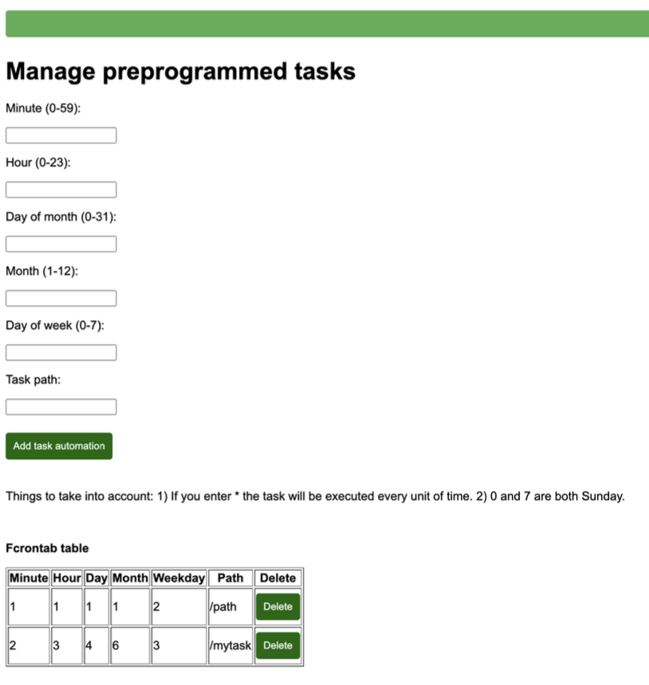
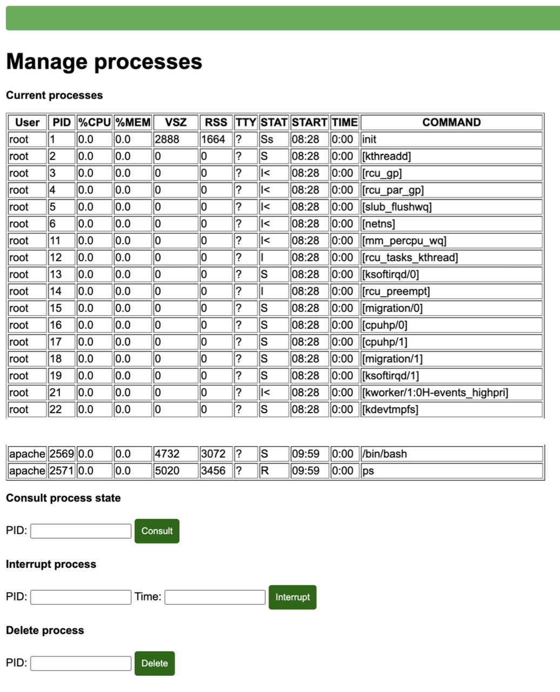

# Linux web controller dashboard

Implemented web server using Apache. The server has a graphical interface that allows to see and manage different parameters of the server's Linux OS. 

Shell scripts were used to "launch" HTML code, to access the different server's parameters and to create all the logic behind the webserver. 

The Linux machine was created from scratch using the LFS detailed instructions. https://www.linuxfromscratch.org/

## Functionalities
- Login screen: Only users that exist in the Linux server can access

- Automount screen: Checks if a USB is connected, shows on the UI all .mp3 files inside the USB with their name and path

- Logs backup: Creates a backup of all the logs with a certain tag generated by the server

- Manage preprogrammed tasks: Create, delete and see preprogrammed tasks in the system

- Filter packages using iptables

- Logs: Shows all the logs of the system that have a certain tag in a list format

- Manage processes: Shows all the current processes in the system, and allows to consult a process state, interrupt or delete a process

- Manage users: Create new users in the Linux machine, delete existing users

- Monitorization: Shows stats like CPU, RAM and Disk usage, last accesses to the server and the server's uptime

- Shutdown and reboot the Linux machine

## Example screens

# Authors
[Pol Valero] (https://github.com/pol-valero)
